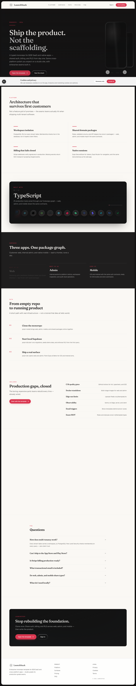

<div align="center">

<p>
  
</p>

# LaunchStack

**The Ultimate Enterprise Full-Stack Monorepo Template**

[](https://nextjs.org/)
[](https://expo.dev/)
[](https://supabase.com/)
[](https://turbo.build/)
[](https://www.typescriptlang.org/)
[](https://playwright.dev/)
[](https://upstash.com/)

_Stop rebuilding the same foundational boilerplate._ <br>
_Start writing business logic on day one._

<br />



</div>

---

## 🌟 Why LaunchStack?

**LaunchStack** is an obsessively configured, production-grade B2B SaaS and cross-platform mobile app template. It uses modern architectures to provide maximum code-sharing, type safety, and scalability without compromising on developer experience.

It's designed for **principled engineers** who want enterprise-level confidence (CI/CD, strict linting, Docker, Sentry, E2E testing) straight out of the box.

---

## 🏗️ Architecture at a Glance

### 📱 Apps (The Frontiers)

- **`apps/web`**: 🌐 Public SaaS and marketing site (Next.js 16 App Router).
- **`apps/admin`**: 🛠️ Internal back-office portal (Next.js 16 App Router, port `3002`).
- **`apps/mobile`**: 📱 iOS and Android app (Expo SDK 57, React Native 0.86, Expo Router).

### 📦 Packages (The Brains & Brawn)

Sharing code across three apps is hard. LaunchStack uses focused workspace packages (single responsibility, no monolithic `index.ts` blobs):

- **`@template/ui`**: 🎨 Web UI (Tailwind CSS, Radix, shared **LaunchStack** brand mark).
- **`@template/mobile-ui`**: 📱 Native UI for Expo (including SVG brand mark).
- **`@template/api`**: 🔌 Typed Supabase client factories and data access.
- **`@template/auth`**: 🔐 RBAC, permission matrices, role assertions.
- **`@template/validation`**: ✅ Zod schemas (enums from `@template/types`).
- **`@template/feature-flags`**: 🚩 Plan entitlements and tier limits.
- **`@template/kv`**: ⚡ Upstash Redis caching and rate limiting.
- **`@template/email`**: ✉️ Transactional email (Brevo), split by domain.
- **`@template/analytics`**: 📊 Event schemas (PostHog).
- **`@template/config`**: ⚙️ Shared ESLint, TypeScript, and env validation.
- **`@template/types`**: 🔠 Domain types and generated Supabase types.

---

## 🛡️ Enterprise-Ready Production Gaps (Solved!)

We went the extra mile so you don't have to:

1. **🤖 CI/CD Automation**: GitHub Actions (`main.yml`, `supabase.yml`) for lint, `expo-doctor`, typecheck, format, unit tests, Playwright auth/onboarding, builds, and migration checks.
2. **🐳 Docker Containerization**: Multi-stage `Dockerfile`s with Next.js `output: 'standalone'` for lean deploys (ECS, Cloud Run, K8s).
3. **🚦 Pre-Commit Hooks**: Husky + `lint-staged` run Prettier on staged files.
4. **🧪 Testing**: Vitest across packages; Playwright marketing, auth, and onboarding E2E in `apps/web`.
5. **🐛 Error Observability**: `@sentry/nextjs` plus `@vercel/otel` instrumentation on web and admin.
6. **🔒 Security Headers**: CSP, HSTS, `X-Frame-Options`, and related hardening on Next.js apps.
7. **⚡ Edge Rate-Limiting & Caching**: `@template/kv` with Upstash Redis and `@upstash/ratelimit`.
8. **🔎 Automated SEO**: `sitemap.ts` and `robots.ts` on the web app.
9. **💳 Fail-Closed Billing Webhooks**: Stripe signatures verified in production; missing `STRIPE_WEBHOOK_SECRET` returns 500.
10. **🔠 Shared Domain Enums**: Roles and statuses live in `@template/types` and flow into Zod — no string drift.

**Monorepo + mobile**: Expo SDK 52+ detects pnpm workspaces and configures Metro automatically, so there is no `metro.config.js` and no `node-linker=hoisted` workaround. The repo sets `auto-install-peers=false` in `.npmrc` so workspace libraries never install a second copy of React Native — one native module instance, which is what `expo-doctor` enforces. Mobile uses TypeScript 6 (Expo 57); web, admin, and shared packages stay on TypeScript 5.9. Do not map `react` in `apps/mobile/tsconfig.json` — Metro reads that file, and pointing `react` at `@types/react` breaks the bundle. See [Architecture](./docs/architecture.md).

---

## 🚀 Quick Start Guide

### 1️⃣ Prerequisites

- **Node.js**: `v22.13+` (required by Expo SDK 57; root `engines` enforce `>=22.13.0`)
- **pnpm**: `v9+` (`npm install -g pnpm`; repo pins `pnpm@9.0.6`)
- **Docker Desktop**: Local Supabase
- **Expo Go** (optional): Physical device testing for `apps/mobile`

### 2️⃣ Clone & Install

```bash
git clone https://github.com/bantoinese83/LaunchStack.git
cd LaunchStack
pnpm install
```

### 3️⃣ Database (Supabase)

Start the local stack (Postgres, Auth, Studio):

```bash
pnpm db:start
```

Apply migrations and seed demo data:

```bash
pnpm db:reset
```

> Local Studio: [http://localhost:54323](http://localhost:54323)

### 4️⃣ Environment Variables

```bash
cp .env.example .env
```

Committed `.env.build` supplies safe placeholders when you have not copied `.env` yet, so `pnpm build` and `pnpm quality` stay warning-free. Real values in `.env` or `.env.local` always win.

For local Supabase, point web and mobile at your local API (keys from `supabase status`):

- Web: `NEXT_PUBLIC_SUPABASE_URL`, `NEXT_PUBLIC_SUPABASE_ANON_KEY`, `SUPABASE_SERVICE_ROLE_KEY`
- Mobile: `EXPO_PUBLIC_SUPABASE_URL`, `EXPO_PUBLIC_SUPABASE_ANON_KEY`

Add Stripe (`NEXT_PUBLIC_STRIPE_PRICE_ID` plus `STRIPE_WEBHOOK_SECRET` for production), Brevo, PostHog, Upstash, and Sentry when you exercise those integrations. Enable Google/GitHub OAuth and MFA in the Supabase Auth dashboard. See [Setup guide](./docs/setup.md) for how `@template/config` validates env at build vs runtime.

### 5️⃣ Run Apps

**Everything (web, admin, mobile Metro):**

```bash
pnpm dev
```

**One app from the repo root:**

| App    | Command             | URL / notes                                                                |
| ------ | ------------------- | -------------------------------------------------------------------------- |
| Web    | `pnpm dev:web`      | [http://localhost:3000](http://localhost:3000)                             |
| Admin  | `pnpm dev:admin`    | [http://localhost:3002](http://localhost:3002)                             |
| Mobile | `pnpm mobile`       | Metro [http://localhost:8081](http://localhost:8081), scan QR in Expo Go   |
| Mobile | `pnpm mobile:clean` | Same as `mobile` with `--clear` (use after dependency or lockfile changes) |
| Mobile | `pnpm dev:mobile`   | Turbo wrapper for the mobile `dev` script                                  |

From `apps/mobile` you can also run `pnpm ios`, `pnpm android`, or `pnpm start:clean`.

### 🧪 Seed accounts (after `pnpm db:reset`)

- **Super Admin**: `admin@launchstack.com` / `LaunchStack!demo`
- **Demo Customer**: `demo@launchstack.com` / `LaunchStack!demo`

---

## 🛠️ Developer Commands Cheat Sheet

Run from the **repository root** unless noted.

| Command                                | What it does                                                 |
| -------------------------------------- | ------------------------------------------------------------ |
| `pnpm dev`                             | Starts web, admin, and mobile dev servers (Turbo).           |
| `pnpm dev:web`                         | Web only.                                                    |
| `pnpm dev:admin`                       | Admin only.                                                  |
| `pnpm dev:mobile`                      | Mobile only (Expo).                                          |
| `pnpm mobile`                          | Expo start (shortcut).                                       |
| `pnpm mobile:clean`                    | Expo start with cleared Metro cache.                         |
| `pnpm build`                           | Production builds (Next standalone + mobile `expo export`).  |
| `pnpm lint`                            | ESLint across the monorepo.                                  |
| `pnpm format`                          | Prettier write.                                              |
| `pnpm format:check`                    | Prettier check (CI).                                         |
| `pnpm typecheck`                       | TypeScript `tsc` / Next typegen where configured.            |
| `pnpm test`                            | Vitest unit tests.                                           |
| `pnpm quality`                         | format:check → lint → typecheck → test → build.              |
| `pnpm --filter @template/web test:e2e` | Playwright marketing, auth, product, and optional signed-in. |
| `pnpm --filter @template/ui storybook` | Component workshop for `@template/ui`.                       |
| `pnpm check:expo`                      | `expo-doctor` (CI also runs this; `quality` does not).       |
| `pnpm db:start`                        | Start local Supabase.                                        |
| `pnpm db:reset`                        | Reset DB, run migrations, seed.                              |
| `pnpm db:types`                        | Regenerate `packages/types/src/supabase.ts` from local DB.   |
| `supabase stop`                        | Stop local Supabase (no root script).                        |

**Playwright E2E** (from `apps/web`, with dev server or CI webServer):

```bash
cd apps/web && pnpm exec playwright test
```

---

## 📚 Deep Dive Documentation

- 📖 [Setup & Local Dev](./docs/setup.md)
- 🏗️ [Architecture & Monorepo Boundaries](./docs/architecture.md)
- 🚀 [Deployment (Docker, Vercel, EAS)](./docs/deployment.md)
- 🔒 [Security Posture & RLS Models](./docs/security.md)
- 📈 [Analytics & Telemetry](./docs/analytics.md)
- 🚑 [Runbooks & Troubleshooting](./docs/runbooks.md)

---

<div align="center">
Made with ❤️ by Principled Engineers. <br>
<i>Ready to build something amazing?</i>
</div>
